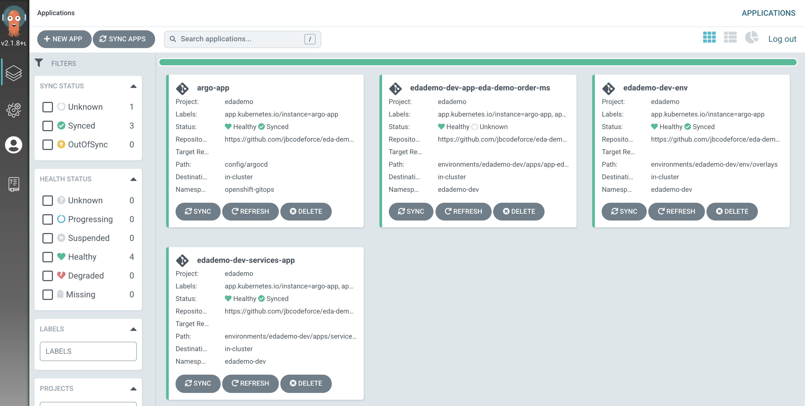

# Demo gitops for an event-driven solution

This gitops repository supports [the article about developer's experience](https://jbcodeforce.github.io/blogs/12-27-21/)
to develop an event-driven microservice solution.

## How it was created

We used KAM CLI to create the project with the following parameters:

Get Github access token, to be used in the KAM bootstrap command, in future steps.


```sh
kam bootstrap \
--service-repo-url https://github.com/jbcodeforce/eda-demo-order-ms \
--gitops-repo-url  https://github.com/jbcodeforce/eda-demo-order-gitops \
--image-repo image-registry.openshift-image-registry.svc:5000/ibmcase/ \
--output eda-demo-order-gitops \
--git-host-access-token <a-github-token> \
--prefix edademo --push-to-git=true
```

## What was added


* Added a bootstrap folder to define gitops and operator declaration and to create an ArgoCD project
* Defined a script to install IBM Catalogs and Cloud Pak for Integration components 
* Added scripts to deploy the gitops, pipelines operators: `scripts/installOperators.sh`
* Add deployment for the producer app in `environments/eda-demo-dev/app-eda-demo-order-ms`

## How to use it

* Login to the OpenShift Console
* Use the script to install GitOps and Pipeline operators: 

    ```sh
    cd bootstrap/scripts/
    ./installOperators.sh
    ```
    
Once the operators are running the command: `oc get pods -n openshift-gitops` should return
a list of pods like:

```sql
NAME                                                          READY   STATUS    RESTARTS   AGE
cluster-54b7b77995-7m5wg                                      1/1     Running   0          4h6m
kam-76f5ff8585-b742t                                          1/1     Running   0          4h6m
openshift-gitops-application-controller-0                     1/1     Running   0          4h5m
openshift-gitops-applicationset-controller-6948bcf87c-jdv2x   1/1     Running   0          4h5m
openshift-gitops-dex-server-64cbd8d7bd-76czz                  1/1     Running   0          4h5m
openshift-gitops-redis-7867d74fb4-dssr2                       1/1     Running   0          4h5m
openshift-gitops-repo-server-6dc777c845-gdjhr                 1/1     Running   0          4h5m
openshift-gitops-server-7957cc47d9-cmxvw                      1/1     Running   0          4h5m
```

* Install IBM product catalog

  ```sh
  ./bootstrap/scripts/installIBMCatalog.sh
  ```

* Obtain your [IBM license entitlement key](https://github.com/IBM/cloudpak-gitops/blob/main/docs/install.md#obtain-an-entitlement-key)
* Update the [OCP global pull secret of the `openshift-gitops` project](https://github.com/IBM/cloudpak-gitops/blob/main/docs/install.md#update-the-ocp-global-pull-secret)
with the entitlement key

    ```sh
    KEY=<yourentitlementkey>
    oc create secret docker-registry ibm-entitlement-key \
    --docker-username=cp \
    --docker-password=$KEY \
    --docker-server=cp.icr.io \
    --namespace=openshift-gitops 
    ```

* Install the different IBM product operators as needed:

    ```sh
    # install cp4i namespace + navigator operator
    oc apply -f bootstrap/ibm-cp4i/cp4i-namespace.yaml
    oc apply -k bootstrap/ibm-cp4i
    # install event streams operator
    oc apply -k bootstrap/ibm-eventstreams
    # Copy the entitlement key in cp4i ns
    oc project cp4i
    ./bootstrap/scripts/copySecrets.sh ibm-entitlement-key openshift-gitops cp4i
    ```

* Install manually the Cloud Pak for integration navigator operand.

    ```sh
    oc apply -f https://raw.githubusercontent.com/ibm-cloud-architecture/eda-gitops-catalog/main/cp4i-operators/platform-navigator/operands/cp4i-sample.yaml
    ```

  This can take up to 45 minutes to install, please wait. 
  
* Install some of the open source products used in this demonstration

  ```sh
  # Elastic Search
  oc apply -k bootstrap/elastic-search/
  ```

* Create ArgoCD project: 

```sh
oc project openshift-gitops
oc apply -k bootstrap/argocd-project
```

* Get the ArgoCD User Interface URL

```sh
oc get route openshift-gitops-server -o jsonpath='{.status.ingress[].host}'
```

* Get the argocd admin password:

```sh
oc extract secret/openshift-gitops-cluster -n openshift-gitops --to=-
```

* Start ArgoCD app of apps, to create instances of Event Streams, and the different services.

```sh
 oc apply -k config/argocd
```

The image below list the first Argoo apps:



* `edademo-dev-env` is for the namespace and service account user.
* `edademo-dev-services-app` is for creating an IBM event streams cluster named `dev` under the `edademo-dev` namespace, 
for configuring the Kafka topics, and scram and tls users.


## How to add more components

